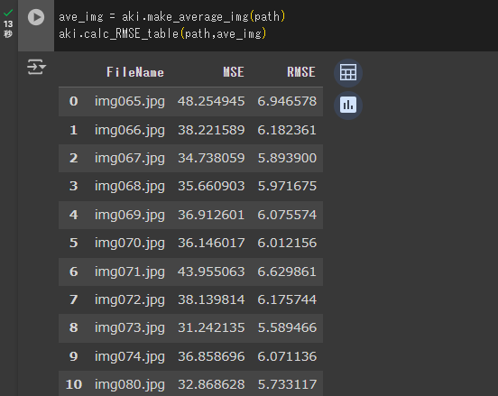

# akikienToolsDev <!-- omit in toc -->

## 目次 <!-- omit in toc -->

- [関数リファレンス](#関数リファレンス)
  - [img_processing](#img_processing)
  - [make_folder](#make_folder)
  - [make_average_img](#make_average_img)
  - [calc_MSE](#calc_mse)
  - [calc_RMSE_table](#calc_rmse_table)
  - [get_RGB](#get_rgb)

## 関数リファレンス

### img_processing

- 画像の前処理 ( トリミングとリサイズ ) を行う関数です。
- 対象は画像ファイル 1 枚ずつを想定しており、ディレクトリに対して使用することはできません。

**【 引数 】**

| 変数名       | 説明                                        |
| ------------ | ------------------------------------------- |
| `path`       | 画像のパス ( str : required )               |
| `trim_range` | クリッピング範囲 ( tuple : required )       |
| `size`       | リサイズ後の画像サイズ ( tuple : required ) |

- `trim_range` の入力型式は `(x_start, x_end, y_start, y_end)` です。
  <br>4 つの int 型データが必須で、単位は px です。
- `size` の入力型式は `(size_x, size_y)` です。
  <br>2 つの int 型データが必須で、単位は px です。

**【 返り値 】**

| 変数名 | 説明                                       |
| ------ | ------------------------------------------ |
| `img`  | 前処理実施後の画像データ ( numpy.ndarray ) |

**【 エラー 】**

- `ValueError: Input tuple size is wrong.`

  引数 `trim_range` または `size` の形式が誤っています。

- `FileNotFoundError: The specified path does not exist.`

  引数 `path` は存在しないパスです。

- `ValueError: No file exists at the specified path.`

  引数 `path` はファイルを指すパスではありません。

- `ValueError: The specified path does not point to an image file.`

  引数 `path` が指すファイルは画像ファイルではありません。
  <br>この関数が許容する拡張子は `['.jpg', '.jpeg', '.png', '.gif', '.bmp']` です。

**【 サンプルコード 】**

```python
# pip コマンドを使用し、GitHub から akikenTools ライブラリをインストール
!pip install akikenTools@git+https://github.com/Toma-Nagano/akikenTools

# インストールしたライブラリの読み込み
import akikenTools as aki
import cv2
import matplotlib.pyplot as plt
from google.colab import drive

# GoogleDrive と同期
drive.mount('/content/drive')

# 変数にデータを入力
path = '/content/drive/MyDrive/ [ 省略 ] /img065.jpg'
trim_range = (0, 3000, 550, 2050)
size = (128, 128)

# 画像の前処理
img = aki.img_processing(path, trim_range, size)

# 前処理を行った画像を表示する
cv2.cvtColor(img, cv2.COLOR_BGR2RGB)
plt.imshow(img)
plt.show()
```

### make_folder

- 指定したディレクトリ内に存在する画像ファイルに一括で前処理を行い、これらをまとめたディレクトリを作成します。
- 対象はディレクトリで、画像ファイルを指すパスには使用することはできません。

**【 引数 】**

| 変数名       | 説明                                                          |
| ------------ | ------------------------------------------------------------- |
| `path`       | オリジナル画像が存在するディレクトリのパス ( str : required ) |
| `target`     | 作成するディレクトリの親ディレクトリのパス ( str : required ) |
| `name`       | 作成するディレクトリの名前 ( str : required )                 |
| `trim_range` | クリッピング範囲 ( tuple : required )                         |
| `size`       | リサイズ後の画像サイズ ( tuple : required )                   |

**【 返り値 】**

| 変数名 | 説明                                                                         |
| ------ | ---------------------------------------------------------------------------- |
|        | 前処理実施後の画像データディレクトリ<br>( 自動でディレクトリを作成します。 ) |

**【 エラー 】**

- `FileNotFoundError: The specified path does not exist.`

  引数 `path` または `target` は存在しないパスです。

- `ValueError: The specified path does not point to a directory.`

  引数 `path` または `target` はディレクトリを指すパスではありません。

- `FileExistsError: The directory already exists.`

  ディレクトリ名が `name` のディレクトリは `target` 内に既に存在します。

- `ValueError: The number of files exceeds 1000.`

  このパッケージで処理できるデータ数は 1000 件までです。

<details>
<summary><strong>【 サンプルコード 】</strong></summary>
<br>

```python
# pip コマンドを使用し、GitHub から akikenTools ライブラリをインストール
!pip install akikenTools@git+https://github.com/Toma-Nagano/akikenTools

# インストールしたライブラリの読み込み
import akikenTools as aki
from google.colab import drive

# GoogleDrive と同期
drive.mount('/content/drive')

# 変数にデータを入力
path = '/content/drive/MyDrive/ [ 省略 ] '
target = '/content/drive/MyDrive'
name = 'aki_test'
trim_range = (0, 3149, 550, 2110)
size = (128, 128)

# 画像の前処理を特定のディレクトリに対して一括で行う
aki.make_folder(path,target,name,trim_range,size)
```

- 実際に、指定したパスに新しいディレクトリが作成されます。

  

</details>

### make_average_img

- 指定したディレクトリ内に存在する画像ファイルを参照し、これらの平均画像を作成します。
- **この際、小数点以下の数値は切り捨てられます。**
- ファイル名昇順で最初に読み込んだ画像サイズに合わせた画像を生成します。
  画像サイズが異なる画像が存在する場合には、平均の算出対象から除外し `Warning` を表示します。

**【 引数 】**

| 変数名 | 説明                                                |
| ------ | --------------------------------------------------- |
| `path` | 画像が存在するディレクトリのパス ( str : required ) |

**【 返り値 】**

| 変数名 | 説明                                   |
| ------ | -------------------------------------- |
| `img`  | 平均画像の画像データ ( numpy.ndarray ) |

**【 エラー 】**

- `FileNotFoundError: The specified path does not exist.`

  引数 `path` は存在しないパスです。

- `ValueError: The specified path does not point to a directory.`

  引数 `path` はディレクトリを指すパスではありません。

- `FileNotFoundError: No image file exists at the specified path.`

  引数 `path` が指すディレクトリ内には、画像ファイルが存在しません。

**【 Warning 】**

- `UserWarning: [ number ] images are not used because of different sizes.`

  ディレクトリ内に画像データのサイズが異なるファイルが存在する時に発生する警告です。
  <br>エラーメッセージ中では、サイズが異なる画像名を一覧表示します。
  <br>例） `['img027.png' , 'img050.png']`

<details>
<summary><strong>【 サンプルコード 】</strong></summary>
<br>

```python
# pip コマンドを使用し、GitHub から akikenTools ライブラリをインストール
!pip install akikenTools@git+https://github.com/Toma-Nagano/akikenTools

# インストールしたライブラリの読み込み
import akikenTools as aki
import cv2
from google.colab import drive

# GoogleDrive と同期
drive.mount('/content/drive')

# 変数にデータを入力
path = '/content/drive/MyDrive/ [ 省略 ]'
target = '/content/drive/MyDrive/ [ 省略 ]'

# 平均画像データの作成
ave_img = aki.make_average_img(path)

# OpenCV ライブラリを使用して平均画像を出力
cv2.imwrite(target, ave_img)
```

</details>

### calc_MSE

- 画像 A , 画像 B の平均二乗誤差を計算します。
- 関数が取る引数は、画像ファイルが存在するパスもしくは、画像データの NumPy 配列です。

**【 引数 】**

| 変数名   | 説明                                                                                           |
| -------- | ---------------------------------------------------------------------------------------------- |
| `target` | MSE 算出対象の画像ファイルが存在するパス / 画像の数値データ ( str / numpy.ndarray : required ) |
| `source` | 基準となる画像ファイルが存在するパス / 基準画像の数値データ ( str / numpy.ndarray : required ) |
| `option` | 差分画像 ( target - source ) を同時に出力するか ( bool : optional , Default = False)           |

**【 返り値 】**

| 変数名      | 説明                                                              |
| ----------- | ----------------------------------------------------------------- |
| `mse_value` | MSE の算出値 ( float )                                            |
| `diff_img`  | 差分画像、`option = True` の場合のみ ( numpy.ndarray , optional ) |

**【 エラー 】**

- `TypeError: The type for the specified argument is incorrect.`

  引数 `target` もしくは `source` に入力されたデータの型が正しくありません。

- `ValueError: The input image sizes do not match.`

  引数 `target` と `source` の画像サイズが一致しません。

<details>
<summary><strong>【 サンプルコード 】</strong></summary>
<br>

```python
# pip コマンドを使用し、GitHub から akikenTools ライブラリをインストール
!pip install akikenTools@git+https://github.com/Toma-Nagano/akikenTools

# インストールしたライブラリの読み込み
import akikenTools as aki
from google.colab import drive

# GoogleDrive と同期
drive.mount('/content/drive')

# 変数にデータを入力
path = '/content/drive/MyDrive/ [ 省略 ]'
target = '/content/drive/MyDrive/ [ 省略 ]'

# 平均画像データの作成
ave_img = aki.make_average_img(path)

# MSE を算出
MSE = aki.calc_MSE(target, ave_img)
print(f'MSE: {MSE}')
```

</details>

### calc_RMSE_table

- ディレクトリ内に存在する全ての画像と基準となる画像との MSE , RMSE を計算します。
- 算出した値は、[ FileName, MSE, RMSE ] を `columns` とする pandas.DataFrame 型にまとめられます。

**【 引数 】**

| 変数名   | 説明                                                                                           |
| -------- | ---------------------------------------------------------------------------------------------- |
| `path`   | MSE 算出対象の画像が存在するディレクトリのパス ( str : required )                              |
| `source` | 基準となる画像ファイルが存在するパス / 基準画像の数値データ ( str / numpy.ndarray : required ) |

**【 返り値 】**

| 変数名       | 説明                                                        |
| ------------ | ----------------------------------------------------------- |
| `RMSE_table` | 画像ファイルごとの MSE , RMSE の算出値 ( pandas.DataFrame ) |

**【 エラー 】**

- `FileNotFoundError: The specified path does not exist.`

  引数 `path` は存在しないパスです。

- `ValueError: The specified path does not point to a directory.`

  引数 `path` はディレクトリを指すパスではありません。

<details>
<summary><strong>【 サンプルコード 】</strong></summary>
<br>

```python
# pip コマンドを使用し、GitHub から akikenTools ライブラリをインストール
!pip install akikenTools@git+https://github.com/Toma-Nagano/akikenTools

# インストールしたライブラリの読み込み
import akikenTools as aki
from google.colab import drive

# GoogleDrive と同期
drive.mount('/content/drive')

# 変数にデータを入力
path = '/content/drive/MyDrive/ [ 省略 ]'
target = '/content/drive/MyDrive/ [ 省略 ]'

# 平均画像データの作成
ave_img = aki.make_average_img(path)

# MSE , RMSE を算出し、得られた表を表示
aki.calc_RMSE_table(target, ave_img)
```

- Google Colabolatory 環境では、pandas.DataFlame を明示的に表示する関数 ( print( ) 文など ) を用いなくても、自動的に表形式でデータを表示してくれます。

  

- pandas ライブラリの機能を使用すれば、出力された pandas.DataFrame を .xlsx 型式に変換することも可能です。

  ```python
  # pandas ライブラリのインポート
  import pandas as pd

  # MSE , RMSE の DataFrame を取得
  df = aki.calc_RMSE_table(path, ave_img)

  # Excel 形式のデータとして出力
  df.to_excel('/content/drive/MyDrive/RMSE_table.xlsx', index = False)
  ```

</details>

### get_RGB

- RGB 画像の特定行 ( 横一列 ) から、RGB 値をそれぞれ取得する関数です。
- 取得した値は、[ X, R, G, B ] を `columns` とする pandas.DataFrame 型にまとめられます。

**【 引数 】**

| 変数名    | 説明                                                                                           |
| --------- | ---------------------------------------------------------------------------------------------- |
| `img`     | RGB 値を取得する画像 ( str / numpy.ndarray : required )                                        |
| `y`       | 画像から RGB 値を取得する行 ( int : required )                                                 |
| `convert` | 読み込んだ画像について、BGR 形式から RGB 型式に変換するか ( bool : optional , Default = False) |

**【 返り値 】**

| 変数名      | 説明                                               |
| ----------- | -------------------------------------------------- |
| `RGB_table` | X, R, G, B の値を各列に持つ表 ( pandas.DataFrame ) |

**【 エラー 】**

- `ValueError: The specified y coordinate is out of range.`

  引数 `y` が画像の縦幅に比べて大きい、もしくは小さいです。

- `ValueError: The specified data is not in the proper format.`

  引数 `img` がカラー画像データではありません。

<details>
<summary><strong>【 サンプルコード 】</strong></summary>
<br>

```python
# pip コマンドを使用し、GitHub から akikenToolsDev ライブラリをインストール
!pip install akikenTools@git+https://github.com/Toma-Nagano/akikenTools

# インストールしたライブラリの読み込み
import akikenTools as aki
import matplotlib.pyplot as plt
from google.colab import drive

# GoogleDrive と同期
drive.mount('/content/drive')

# 変数にデータを入力
img = '/content/drive/MyDrive/ [ 省略 ]'

# RGB 値を取得
df = aki.get_RGB(img, 1250)

# RGB 値の変化をグラフに描画
plt.plot(df['X'], df['R'], c = 'r')
plt.plot(df['X'], df['G'], c = 'g')
plt.plot(df['X'], df['B'], c = 'b')
plt.show()
```

</details>
